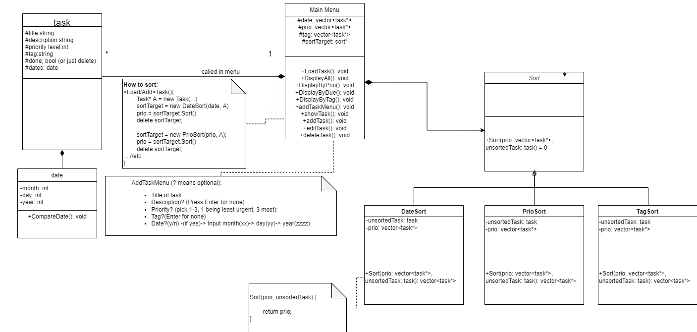
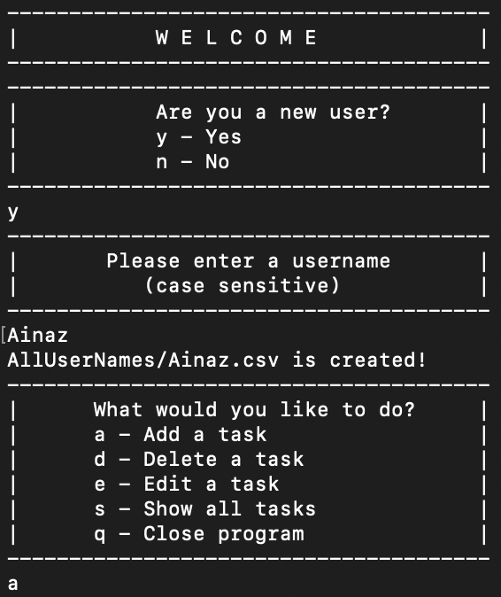
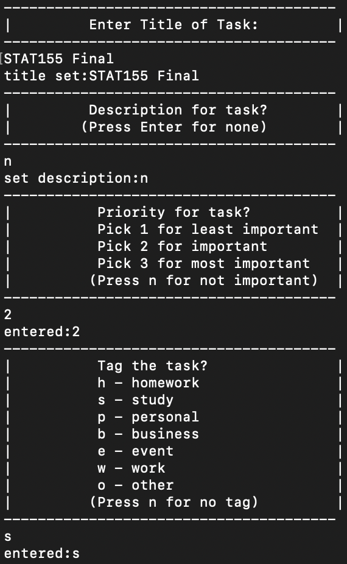
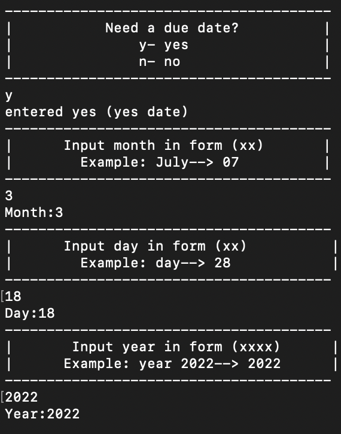
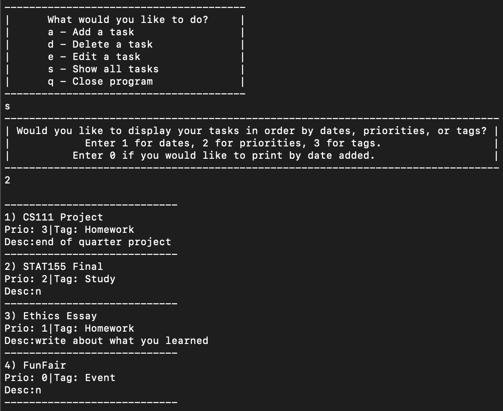
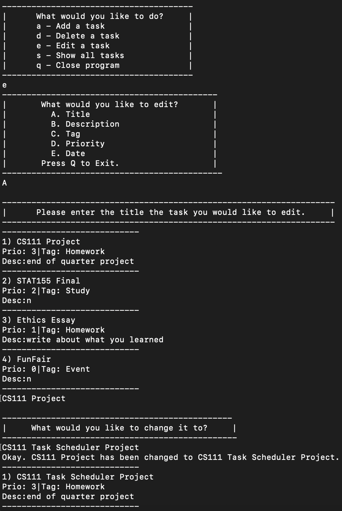
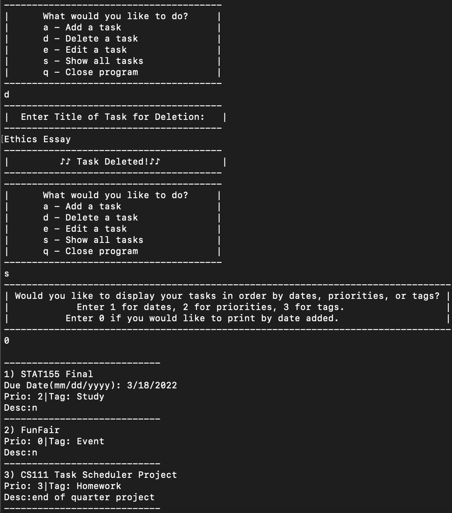
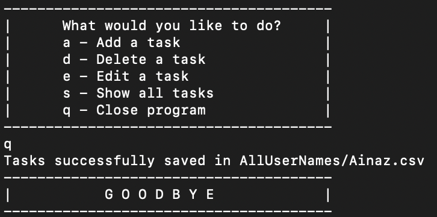
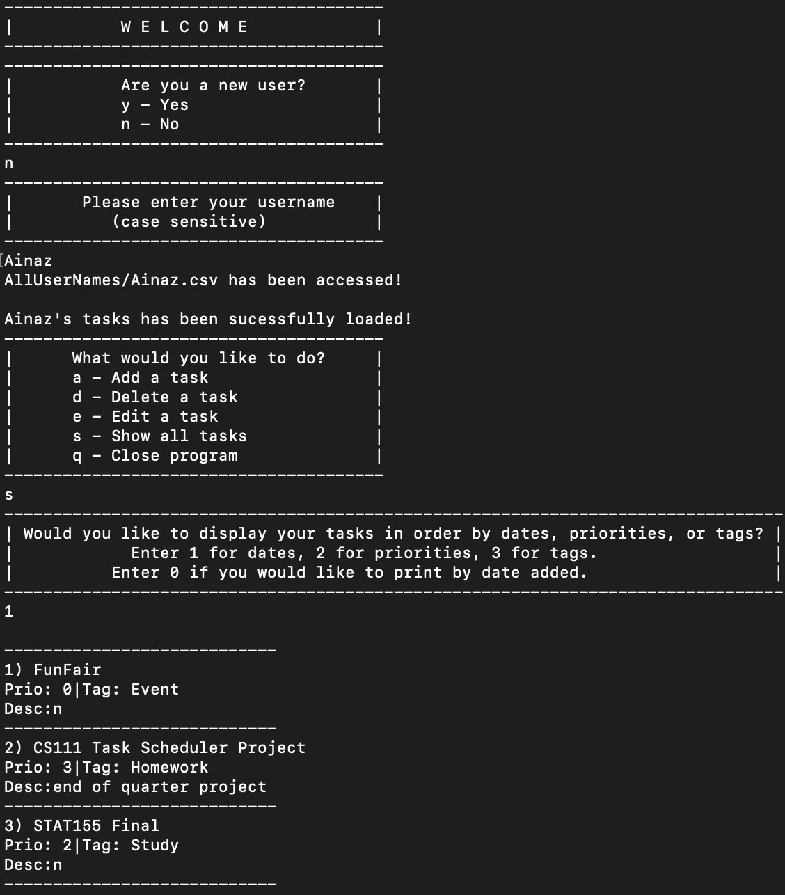

# Task Manager
 > Authors:
 >  
 > [Ainaz Estiri](https://github.com/AinazEstiri)
 > 
 > [Jason Lo](https://github.com/lojason71)
 > 
 > [Brandon Hoang](https://github.com/brandoh4258)
 > 
 > [Brandon Nguyen](https://github.com/penwin2468)
 > 
 > [Yenna Chang](https://github.com/ychan092)


## Phase I: Project Description

### Why is this project important to us?
Task managers are helpful when juggling multiple responsibilites, making sure deadlines are met in a proactive manner, and staying orgagnized. In the form of a comprehensive todo list, we aimed to create a space where the user has a visual representation of the tasks they must accomplish. Our group hopes that the program is a useful productivity tool for students and professionals who aim to be more productive with less stress.

### Languages/Tools/Technologies Used
	* C++
	* Google Tests
	* Valgrind
	* CMake/Makefile
   
### Input/Output & Features
A user can create tasks to include a title, description, classification (e.g. personal, work, study), priority, and a due date. Additional features are optional, so the user can customize their list to be as comprehensive or simple as they choose. This list can represent larger tasks with subtasks within them or be a simple todo list. Users can also display, edit, and delete tasks through the main menu.

## Phase II: Design

### Task Manager Prototype Pattern


Main menu implements a user interface for the user to edit/delete/create tasks. Sort class sorts tasks into three different categories. Tasks itself contains the attributes that the user would like to track, sort, and find.

1. The intent of the strategy pattern is to encapsulate an algorithm. In particular, we can encapsulate multiple implementations of similar algorithms. We can also extend the number of different strategies at will. Ultimately, to implement different algorithms appropriate to the user’s different situations.

2. We chose to implement a strategy pattern because, we had multiple sorting strategies/algorithms to use dynamically during run-time.

3. Coding strategy patterns allows us to think in modules, it also eliminates conditional statements. Additionally, it helps us understand the nature of composition and inheritance relationships. The pattern also teaches us on a great use of encapsulation.
 
## Phase III: Development, Testing and Scrum Meeting

## Screenshots
Screenshots of the input/output after running your application
 
 >
 
 >
 
 >
 
 >
 
 >
 
 >
  
 >
  
 >

## Installation/Usage
To use this program, use an IDE to clone this repository.
```
$ git clone https://github.com/cs100/final-project-bhoan008-jlo034-aesti002-bnguy225-ychan092.git
$ cd final-project-bhoan008-jlo034-aesti002-bnguy225-ychan092
$ cmake3 .
$ make
$ ./TaskManager
```
Follow the sequence within main.cpp as follows:

1. Ask if new user
2. Ask for a username
3. Ask for a title
4. Ask for a description (optional)
5. Ask for a priority (optional)
6. Ask for a tag (optional)
7. Ask for date (optional)
8. Choose option from menu to manage program
	* Add a task
	* Delete a task
	* Edit a task
	* Show all task
	* Close program 

## Testing
We used Coninuous Integration for testing:
>

